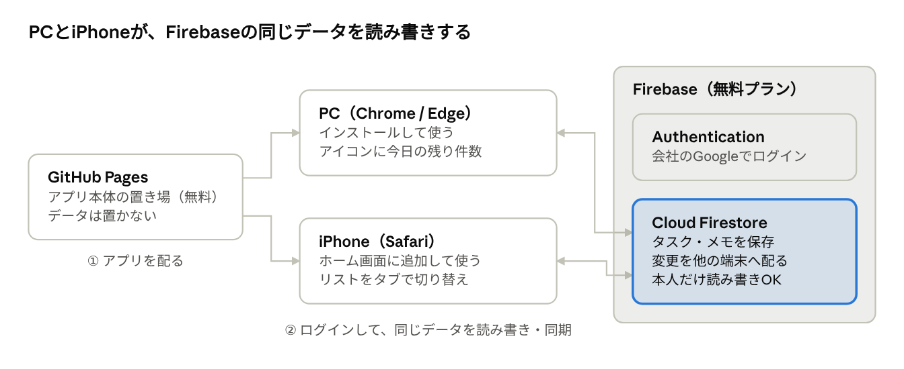

きょうのタスク　アプリの作りの説明  

────────────────────────

■ 全体の構成  

アプリ本体はGitHub Pagesに、データはFirebaseに置き、PCとiPhoneの両方から同じデータを読み書きする作り。  
自分で管理するサーバーはなく、すべて無料のサービスで動いている。  

GitHub Pagesはアプリの画面とプログラムを配るだけで、タスクの中身はすべてFirebase側にある。  

────────────────────────

■ なぜクラウド（Firebase）が必要になったのか  

スマホでも同じタスクを見て操作するには、PCとスマホの両方から届く場所にデータを置く必要があったため。  

・最初の版（v1）は、データをPCのブラウザの中（localStorage）だけに保存していた。サーバーを使わないので手軽で、外にデータが出ない安心感もあった  
・ただこの保存場所は「そのPCのそのブラウザ」専用で、ほかの端末からは見えない。スマホで同じURLを開いても、空っぽのアプリが出るだけだった  
・「出先で急ぎのTODOを確認したい」「スマホで完了したらPCの数字も減ってほしい」を叶えるには、データをネット上の1か所にまとめ、PCとスマホがそこを読み書きする形に変える必要があった。その置き場所として使ったのがFirebase  

────────────────────────

■ なぜFirebaseを選んだのか  

サーバーを自分で立てずに、「同期」「ログイン」「オフライン対応」を無料でまとめて用意できたのがFirebaseだったため。FirebaseはGoogleが提供している、アプリ向けのクラウドサービス。  

検討した置き場所は次の3つ。  

| 置き場所 | 同期の速さ | PCとスマホで同時に触ったとき | 初期設定・運用 | 結論 |
| --- | --- | --- | --- | --- |
| Firebase（Firestore） | ほぼすぐ。変更が相手の画面に自動で届く | タスク1件ずつ保存するので、別のタスクなら打ち消し合わない | 画面での設定だけ。サーバー管理は不要 | 採用 |
| Googleドライブにファイルで保存 | 開いたとき・保存したときだけ | ファイル丸ごと上書きなので、片方の変更が消えることがある | Googleの開発者向け設定が必要で、Firebaseより手間 | 不採用 |
| 自分でサーバーを用意 | 作り次第 | 作り次第 | サーバー代・更新・障害対応がずっと必要 | 不採用 |

Firebaseで使っているのは2つの機能だけ。  

・Authentication（ログイン）：会社のGoogleアカウントでログイン。パスワードを新しく作らずに「本人かどうか」を確かめられる  
・Cloud Firestore（データベース）：タスク・メモ・リストを保存。変更を他の端末へ自動で配り、電波がないときは端末内に貯めておいて、つながったら送ってくれる  

────────────────────────

■ 料金とセキュリティ  

料金は0円で運用している。データを読み書きできるのは、登録した本人のアカウントだけ。  

料金  
・Firebaseは無料プラン（Spark）で使っている。クレジットカードも支払い情報も登録していないので、請求は発生しない  
・無料プランには1日あたりの読み書き回数などの上限がある。個人のToDo程度なら収まる見込みだが、具体的な上限は [Firebaseの料金ページ](https://firebase.google.com/pricing) で確認してほしい  
・上限を超えた場合も、無料プランのままなら課金されるのではなく、その日は使えなくなる仕組み  
・「SMS多要素認証」など有料につながる機能や、「アップグレード」は使っていない  
・アプリ本体を置いているGitHub Pagesも、公開リポジトリなら無料  

セキュリティ  
・Firebase側に「登録した会社のGoogleアカウントでログインした本人だけ、自分のデータを読み書きできる」というルールを設定している。それ以外の人はログインできてもデータに触れない  
・GitHubに公開されているのはアプリのプログラムだけ。他の人がURLを開いてもログイン画面が出るだけで、タスクの中身は見えない  
・プログラムの中にはFirebaseへの接続設定（firebaseConfig）が入っているが、これは「どのFirebaseにつなぐか」を示す値で、公開される前提のもの。データを守っているのは上のルールのほう  
・データの保存場所は東京リージョン（asia-northeast1）  
・会社のGoogleアカウントでFirebaseのプロジェクトを作っているので、会社の管理者からはプロジェクトの存在が見える可能性がある（未確認）  
・入れているのは仕事のToDoのみ  

────────────────────────

■ 使っている部品と役割  

どれも無料で使えるものだけで組んでいる。  

| 部品 | 何をしているか |
| --- | --- |
| PWA（HTML・CSS・JavaScript） | アプリの画面と動き。ブラウザから「インストール」すると、普通のアプリのように単独のウィンドウで開ける |
| GitHub Pages | アプリのファイルを置いておく場所。httpsのURLがもらえる（PWAのインストールにhttpsが必要） |
| Badging API | タスクバーのアイコンに今日の残り件数を出す、Chrome・Edgeの機能 |
| Service Worker | アプリのファイルを端末に保存しておき、電波がなくても起動できるようにする |
| Firebase Authentication | 会社のGoogleアカウントでのログイン |
| Cloud Firestore | タスク・メモ・リスト・繰り返し設定の保存と、PCとスマホの同期 |

アプリに使っているFirebaseのプログラムは、外部から読み込まずにアプリのファイルと一緒に置いている。そのため、電波がないときでもアプリを開ける。  

────────────────────────

■ データの流れ  

スマホで「完了」を押すと、数秒でPCの画面とアイコンの数字にも反映される（PCのアプリが開いている場合）。逆向きも同じ。  

1. スマホで「完了」を押す
2. まずスマホの中に保存されて、画面がすぐ変わる。電波がなければここで待ち、つながったら次へ進む
3. 変わったタスク1件分だけがFirestoreに送られる
4. Firestoreが、同じアカウントで開いているPCに変更を知らせる
5. PCの画面が自動で更新され、今日の残り件数とアイコンの数字が減る

アプリのヘッダーには「☁ 同期済み」「⏳ 送信待ち」「📴 オフライン」のどれかが出るので、同期の状態が分かる。繰り返しタスクは「ルール＋日付」で名前を付けているので、PCとスマホがそれぞれ作っても二重にはならない。  

────────────────────────

■ 制約・注意点  

サーバーを持たない簡単な作りなので、次の制約がある。  

・アプリを完全に閉じている間は、日付が変わってもアイコンの数字は更新されない。次に開いたときに反映される  
・iPhoneのアイコンには数字を出していない。iPhoneで数字を出すには通知の許可が必要になるため（[WebKitの説明](https://webkit.org/blog/14112/badging-for-home-screen-web-apps/)）  
・初めて使う端末は、ログインにネット接続が必要  
・PCとスマホで同じタスクをほぼ同時に編集すると、後から保存した方の内容になる  
・アプリを更新したら、反映まで数分〜10分ほどかかることがある（GitHub Pagesとブラウザのキャッシュのため）  
・万一に備えて、アプリから全データをJSONファイルで書き出せるようにしてある  

